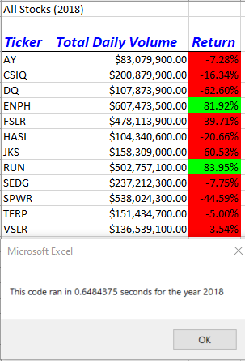

# stock-analysis

## Project Overview

Our inital analysis was for a limited dataset. Steve would like to increase the dataset to include the entire stock market for the last few years. To accomodate the larger dataset we will refactor the code to see if it will run faster.
## Purpose
The purpose of this project is to see if we can improve the performance of our code by refactoring.

### Results
#### Starting Point
Our inital code worked well based on the original dataset. Here are the process times for each year.

Here are the process times after the code has been refactored.

