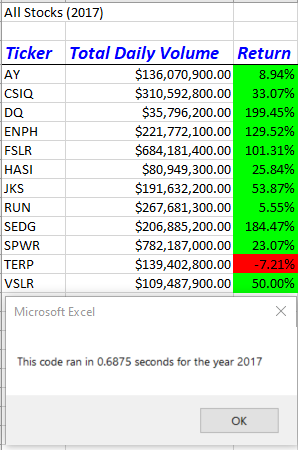
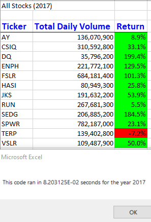
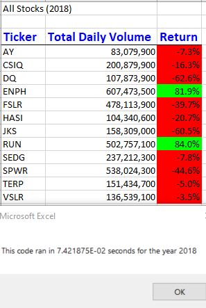

# stock-analysis

## Project Overview

Our inital analysis was for a limited dataset. Steve would like to increase the dataset to include the entire stock market for the last few years. To accomodate the larger dataset we will refactor the code to see if it will run faster.
### Purpose
The purpose of this project is to see if we can improve the performance of our code by refactoring.

## Results

Our inital code worked well based on the original dataset. Here are the results and process times for each year.

 

To increase the efficiency and process time I refactored the code using arrays to store the data for each ticker.

Here are the results and process times after the code has been refactored.

 

You can see that the output is the same, with only slight variance due to rounding, but the code ran significantly faster.

## Summary

Writing code that will calculate the data in place can work just fine for smaller datasets. It is less complicated, so less prone to error. For larger datasets, using arrays to store and calculate the data will be more efficient. The biggest drawback for this particular code, it is not dynamic. If another ticker was added to the list, this code would not be able to handle it without being updated to increase the size of the arrays.
